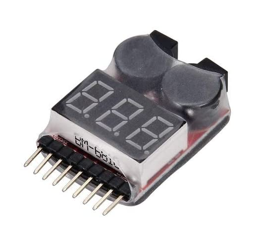

# Quadcopter Drone 3D Print Design
A 3D printed quadcopter drone design that protects the main electronic control and contains all the necessary assembly drills and mounts. 
This drone design also comes with a replaceable cover that contains a standardiced GoPro camera mount on top by default.
The complete quadcopter 3D print design was done in the free tool [tinkercad](https://www.tinkercad.com/), which is one of the most genious 3D design tools available today.

The main quadcopter drone 3D print design consists of 4 individual parts that can easily be replaced in case of flight damage. All parts were designed to be printable and optimized for our Prusa Mini 3D printer (kudos to [Josef Průša](https://www.prusaprinters.org/), the mastermind behind modern DIY printer designs).

Those 4 main parts are:
- 4 arms with standard motor holder
- body case bottom
- body case top
- akku case 

The typical list of parts to equip this drone design is:
- 4 outrunner motors (A2212/10T)
- 4 ESC motor speed controllers
- 1 flight controller (in my case a Mini APM V3.1 ArduPilot)
- 1 RC 4 channel receiver
- 1 3Cell 11.1 V Wellington Accu
- 1 Lipo Battery Monitor 

See a photo of my outrunner motors below:

See a photo of a typical RC channel receiver below:

See a photo of my battery monitor:

